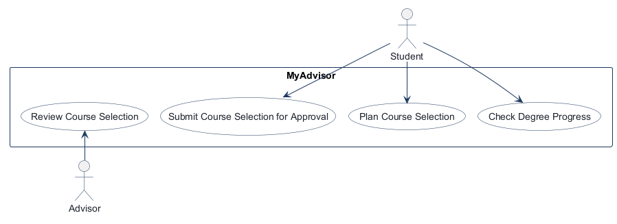
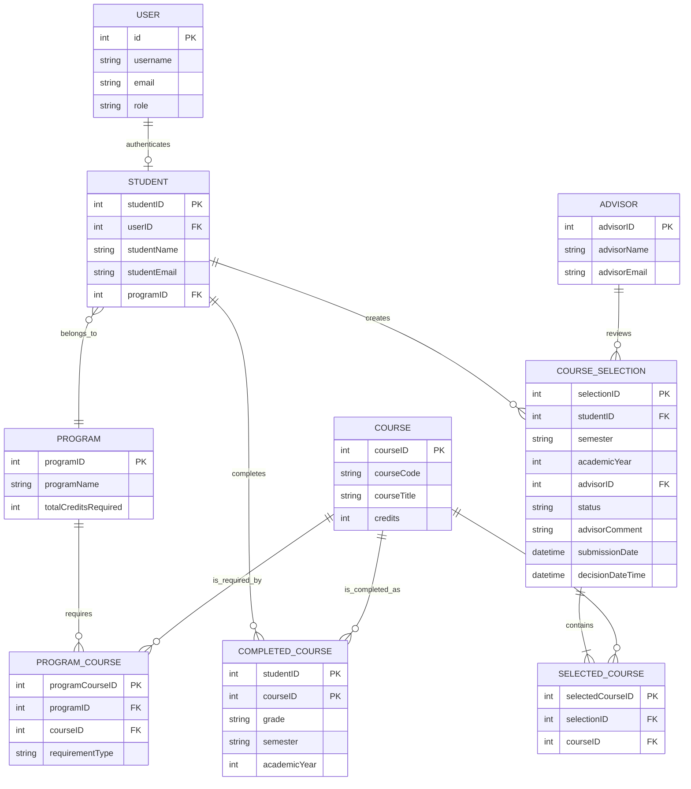
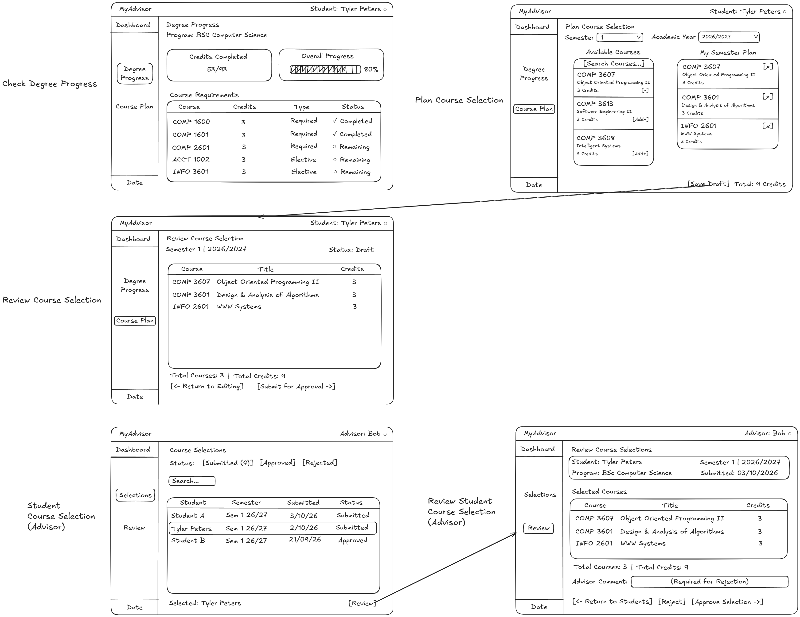

# COMP 3613 Assignment 1

Draft this file with the Guide. **Update it after every phase milestone** before you pause. The use-case diagram is a UML PNG at `docs/diagrams/use-case.png`, linked from this file as `diagrams/use-case.png` (path relative to `docs/report.md`). The model diagram is Mermaid. **Embed wireframe images** as `wireframes/<file>` (files live in `docs/wireframes/`).

Do not put your student ID in this file if you will commit it. The PDF cover adds your name and ID at export time.

## Assigned project
MyAdvisor

## Named workflows

### 1. Check Degree Progress (Student)

### 2. Plan Course Selection (Student)

### 3. Submit Course Selection for Approval (Student)

### 4. Review Course Selection (Advisor)

## Use case diagram

The four named workflows are modeled as separate use cases, with Student and Advisor as their respective actors. No include or extend relationship was selected for this draft, and authentication is outside the diagram's scope.

## Model diagram

Phase 3 first draft. The model supports degree-progress tracking, semester planning,
submission and advisor review. `ProgramCourse` is a bridge entity so each program
can define its required course set. A student's course selection is unique per
semester and academic year, and a course cannot be repeated within that selection.

## Wireframes

Phase 4 wireframes for the four named workflows are shown below. The composite
wireframe covers degree progress, course planning, student submission, and
advisor review.

### Check Degree Progress

The student dashboard shows the selected program, completed-credit progress,
and the status of required and elective courses.

### Plan Course Selection

The student chooses a semester and academic year, searches available courses,
and adds courses to a semester plan before saving a draft.

### Submit Course Selection for Approval

The student reviews the selected courses and total credits, returns to editing
if needed, or submits the plan for advisor approval.

### Review Course Selection

The advisor filters submitted selections, opens a student's plan, and approves
or rejects it with an optional comment field that becomes required for a
rejection.

## Theming

Phase 5 branding preferences: white is the primary color, a deep
burgundy-maroon inspired by Iron Man's red armor is the secondary color, and a
light cream/off-white is the main color, dark leather brown is the secondary
color, and lighter brown is the third accent color. Calibri is used for all
text. The application
uses the `MyAdvisor` wordmark without a separate logo.

The theme has been applied to the landing, login, register, and authenticated
shell surfaces. The landing copy now introduces degree-progress tracking,
course planning, and advisor review instead of the FastStarter placeholder.

## Phase 5 verification and polish

Theme milestone complete. The next milestone is implementing and verifying each
named workflow against its wireframe, then recording any UI, workflow, and model
revisions here.

## Implementation notes

Phase 3 model decisions:

- A student belongs to exactly one program.
- `CompletedCourse` records the student's completed courses, including grade and
  semester/year.
- `CourseSelection` represents one semester plan per student. Its status is
  `draft`, `submitted`, `approved`, or `rejected`; `decisionDateTime` records when
  the assigned advisor makes the approval/rejection decision. An advisor may
  review many course selections, and each selection is reviewed by the student's
  assigned advisor.
- `SelectedCourse` links planned courses to a selection. A unique constraint on
  `(selectionID, courseID)` prevents duplicates.
- `ProgramCourse` links programs to their required courses and records the
  requirement type, allowing degree progress to be calculated.
- Phase 5 added a `Student` bridge from the authenticated `User` account to the
  assigned `Program`. This preserves the starter authentication model while
  allowing degree-progress records to use the ERD's student identity.

## Phase 5 workflow milestone: Check Degree Progress (Student)

The first workflow is implemented. The authenticated home screen now calculates
required-course progress from `Program`, `Course`, `ProgramCourse`, `Student`,
and `CompletedCourse` records. It displays the program name, completed credits,
percentage progress, and each required course's completed or outstanding status.
The route calls a degree-progress service, which calls a repository; database
queries remain outside the router.

Verification: the new tables were created successfully with
`python manage.py init --no-drop`, and the changed Python files passed
diagnostics and compilation. The next verification step is to compare the
dashboard against the Phase 4 wireframe and record any UI or data mismatch
before implementing Plan Course Selection.

Polish note: the dashboard keeps a flat whole-number percentage and a
dynamically sized required-course list so larger programs remain usable. Thin
leather-brown borders were added to the progress and required-course cards for
clearer separation against the cream workspace.

## Phase 5 workflow milestone: Plan Course Selection (Student)

The second workflow now saves one editable draft per student, semester, and
academic year. The planning screen provides semester/year controls, available
course cards, selected-course checkboxes, and a Save draft action. The
`CourseSelection` and `SelectedCourse` tables implement the ERD rule that a
course cannot be duplicated within one selection, while the route delegates
planning and persistence to the repository/service layer. The planning screen
was polished to match the wireframe with separate available-course and
semester-plan columns, a searchable scrollable course list, Add/Remove
controls, and a live selected-course credit total. Academic year is represented
as a range such as `2026/2027`. The final planning polish keeps both columns
dynamic while making each list scroll after approximately three entries,
updates partial-match search in real time while typing, and adds an `x` remove
control to each semester-plan entry. Academic year is now selected from four
range options (`2026/2027` through `2029/2030`). The authenticated sidebar now
stretches with the page content so Logout remains at the bottom of the full
workspace.

The planning workflow now preserves the selected semester and academic-year
range after saving. Submitted plans are read-only and cannot be overwritten;
students can select another semester or academic year to create a separate
draft. A Plan History page lists saved drafts and previous submissions with
their courses, credit totals, statuses, and links to the full review details.
Drafts and submitted plans can be deleted from history. Submitted plans use a
separate confirmation because deletion removes an accidental submission and
its selected-course records.

### Phase 5 workflow milestone: Review Course Selection (Advisor)

The advisor now has a separate workspace at `/advisor`. The seeded admin
account is treated as the advisor role and is redirected to this workspace
after login. Advisors can see submitted plans, open a course-by-course review,
and approve or reject a submitted selection. Student review and history pages
also display the resulting approved or rejected status.

Advisor review history now provides status filtering through a search bar and
shows approved and rejected plans with their course totals and comments. A
rejection requires an advisor comment, which is shown on the student's review
and history pages. Rejected plans can be reopened as drafts for the same
semester and academic year, allowing the student to revise and resubmit
without deleting the prior rejection.

Students can maintain their own degree progress from the Home page. Each
program course is classified as Core or Elective, and students can mark it
completed or outstanding. The Home page presents the required-course list in
separate Core and Electives tabs while retaining the completed-credit progress
calculation.

The planning lists now use responsive viewport sizing with `clamp()`, so their
scroll regions adapt to the screen height. A separate Review & Submit action
opens the next workflow page, preserving the selected semester and academic
year; Save Draft remains available as an independent action.

Semester plans now show credits as `x/15 credits`. The planning screen warns
when the live selection exceeds 15 credits, and the review page explains that
exceeding the limit may result in advisor rejection.

Integration polish: completed courses are now excluded from the available
course list, so a course such as COMP 3613 cannot be planned again. Draft
replacement now flushes removed selected-course rows before inserting the new
set, preventing the unique-constraint error that previously caused a 500
response. Verification confirmed that saving a draft returns 303 and the
selected course appears on the review page.

The degree-progress required-course list is now a responsive scroll region, so
larger catalogs do not make the home page excessively long. The review page
also retains submitted selections and displays their status, semester,
academic year, course count, credit total, and advisor-review message after
submission.

Verification confirmed the complete path: a draft saves with HTTP 303, submit
redirects to the review page with encoded semester/year parameters, and the
review page displays `Submitted for advisor review` plus the submitted plan
details.

The course catalog seed was expanded from the supplied
`MyAdvisor - Computer Science General Major Courses.txt` list. Re-running
`python manage.py init --no-drop` now idempotently adds the COMP, INFO, and
MATH courses, links them to the Computer Science program, and keeps completed
courses excluded from planning. This provides enough dummy data to exercise
search, scrolling, selection, and the 15-credit warning.

One named workflow at a time. Include verify notes and polish / model revisions (Phase 5). Do not treat the first build as final.

## Deployed app

Phase 6. Public Render URL (not localhost). Markers open this to mark the three workflows.

https://

## Logins

Every account a marker needs, including extra users you added. Starter accounts:

- bob / bobpass — regular user
- admin / adminpass — admin

## YouTube URL

## Session transcripts

Filled when the Guide builds the report: the agent writes each Guide chat to `docs/transcripts/<slug>.md` (Copilot Agent, Cursor, or OpenCode). `python manage.py report` packages them. Do not paste chats here during the build.

## Competency (student-judge)

Filled when the report is built. Guide runs student-judge, writes `docs/judge.md`, and export appends the scorecard here.

## Skill integrity

Filled by `python manage.py report`. Do not edit the course skills.
